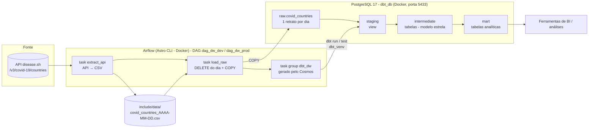
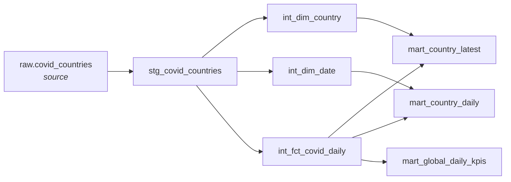
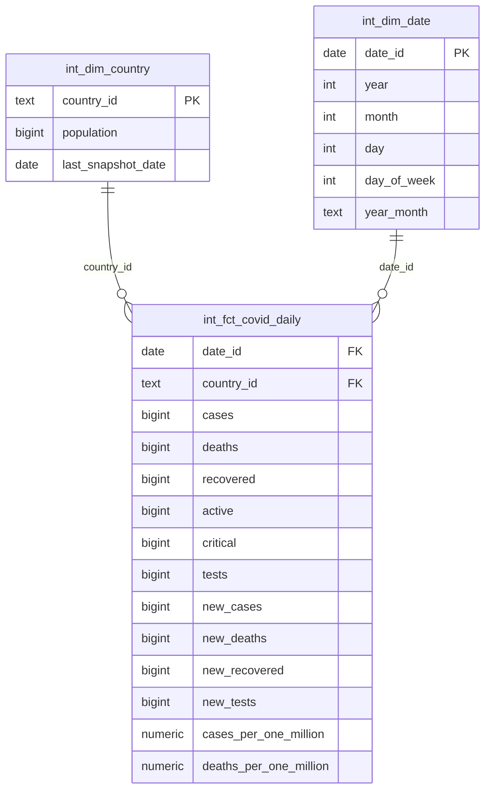

# Projeto Prático de Engenharia de Dados

Pipeline de dados ponta a ponta sobre **COVID-19 em 20 países**: todos os dias, uma API pública é consultada, o resultado é carregado em um PostgreSQL, transformado em um Data Warehouse com **dbt** (camadas staging → intermediate → mart) e tudo é orquestrado pelo **Apache Airflow** (via Astro CLI + Astronomer Cosmos).

---

## Sumário

1. [Visão geral](#visão-geral)
2. [Arquitetura](#arquitetura)
3. [Stack utilizada](#stack-utilizada)
4. [Estrutura de pastas](#estrutura-de-pastas)
5. [Os dados](#os-dados)
6. [Etapa 1 — Ambiente local (`01.local_setup`)](#etapa-1--ambiente-local-01local_setup)
7. [Etapa 2 — Data Warehouse com dbt (`02.data_warehouse`)](#etapa-2--data-warehouse-com-dbt-02data_warehouse)
8. [Etapa 3 — Orquestração com Airflow (`03.airflow`)](#etapa-3--orquestração-com-airflow-03airflow)
9. [Como executar o projeto do zero](#como-executar-o-projeto-do-zero)
10. [Ambientes dev e prod](#ambientes-dev-e-prod)
11. [Portas utilizadas](#portas-utilizadas)
12. [Problemas comuns](#problemas-comuns)

---

## Visão geral

O projeto é dividido em três etapas, cada uma em sua própria pasta:

| Etapa | Pasta | O que faz |
|---|---|---|
| 1 | `01.local_setup` | Sobe o PostgreSQL (Docker) que funciona como Data Warehouse e prepara o ambiente Python com o dbt |
| 2 | `02.data_warehouse` | Projeto dbt (fonte única): lê a tabela `raw` e cria as views/tabelas de staging, intermediate e mart |
| 3 | `03.airflow` | Airflow rodando via Astro CLI: consulta a API, grava o resultado em CSV, carrega na tabela `raw` e, em seguida, o Cosmos executa o dbt com uma task por modelo |

**Resultado final:** tabelas analíticas (marts) prontas para BI — situação atual e rankings por país, evolução diária com média móvel e KPIs consolidados — atualizadas automaticamente todos os dias, **acumulando um histórico diário** a partir da primeira execução.

---

## Arquitetura



### Fluxo de execução

1. O Airflow lê `dags/dag.py`. O **Cosmos** (`DbtTaskGroup`) inspeciona o projeto dbt (`02.data_warehouse/dw`, montado em `/usr/local/airflow/dbt/dw`) e cria **uma task para cada modelo e teste**, respeitando as dependências declaradas com `ref()` e `source()`.
2. Diariamente (`@daily`), o scheduler dispara a DAG:
   1. **`extract_api`** — consulta a API para cada um dos 20 países, mantém só as colunas de interesse e grava `include/data/covid_countries_<data>.csv`;
   2. **`load_raw`** — cria o schema/tabela `raw.covid_countries` (se não existir), apaga o retrato do dia (se já houver) e carrega o CSV com `COPY`, tudo em uma única transação;
   3. **`dbt_dw`** — só começa depois da carga. Cada task do grupo:
      1. gera um `profiles.yml` temporário a partir da **conexão do Airflow** (`docker_postgres_db` ou `railway_postgres_db`);
      2. roda `dbt deps` (instala `dbt_utils`, `dbt_expectations`);
      3. executa `dbt_venv/bin/dbt run --select <modelo>` ou `dbt test`.
3. O dbt conecta no PostgreSQL e materializa as views/tabelas em cada camada.

> **Por que um retrato por dia?** A API devolve apenas os **totais acumulados do momento** — não existe histórico nela. Se a tabela fosse sobrescrita (`TRUNCATE`), cada dia apagaria o anterior. Guardando uma linha por `snapshot_date` + `country`, o histórico cresce a cada execução e permite calcular variações diárias (`new_cases`, `new_deaths`).

### Linhagem dos modelos (DAG do dbt)



---

## Stack utilizada

| Ferramenta | Versão | Papel |
|---|---|---|
| PostgreSQL | 17 (Docker) | Data Warehouse |
| dbt-core / dbt-postgres | 1.10+ local / 1.9.0 no Airflow | Transformações SQL em camadas |
| dbt_utils | 1.3.0 | Macros e testes utilitários |
| dbt_expectations | 0.10.8 | Testes avançados de qualidade de dados |
| Apache Airflow | 3.x (Astro Runtime 3.1-8) | Orquestração |
| Astro CLI | — | Sobe o Airflow localmente em Docker |
| astronomer-cosmos | — | Converte o projeto dbt em tasks do Airflow |
| requests | — | Chamadas HTTP à API (já incluso no Airflow) |
| uv | — | Gerenciador de ambiente/dependências Python (etapa 1) |
| Docker / Docker Compose | — | Containers do Postgres e do Airflow |

---

## Estrutura de pastas

```
projeto_engenharia_de_dados/
├── 01.local_setup/
│   ├── docker-compose.yml        # PostgreSQL 17 do Data Warehouse (porta 5433)
│   ├── pyproject.toml / uv.lock  # Dependências Python (dbt, pandas, etc.)
│   └── .env                      # DBT_USER e DBT_PASSWORD (não versionar!)
│
├── 02.data_warehouse/
│   └── dw/                       # Projeto dbt (fonte única, usado também pelo Airflow)
│       ├── dbt_project.yml       # Configuração do projeto e materializações
│       ├── packages.yml          # dbt_utils e dbt_expectations
│       ├── profiles.yml          # Conexão local (ignorado pelo git)
│       └── models/
│           ├── staging/
│           │   ├── sources.yml               # Declara raw.covid_countries
│           │   └── stg_covid_countries.sql   # Tipagem (view)
│           ├── intermediate/
│           │   ├── _intermediate.yml         # Testes de qualidade
│           │   ├── int_dim_country.sql
│           │   ├── int_dim_date.sql
│           │   └── int_fct_covid_daily.sql
│           └── mart/
│               ├── mart_country_latest.sql
│               ├── mart_country_daily.sql
│               └── mart_global_daily_kpis.sql
│
└── 03.airflow/                   # Projeto Astro (Airflow)
    ├── Dockerfile                # Imagem Astro Runtime + virtualenv com dbt
    ├── requirements.txt          # Pacotes Python do Airflow (cosmos, provider postgres)
    ├── docker-compose.override.yml  # Monta ../02.data_warehouse/dw dentro dos containers
    ├── .env                      # Timeouts de parse da DAG (ignorado pelo git)
    ├── .astro/config.yaml        # Porta do Postgres interno do Airflow (5435)
    ├── include/
    │   └── data/                 # CSVs gerados pela extract_api (ignorados pelo git)
    └── dags/
        └── dag.py                # extract_api + load_raw + tasks do dbt (Cosmos)
```

> O projeto dbt existe **em um único lugar** (`02.data_warehouse/dw`). O Airflow o enxerga por um volume do Docker, então alterações nos modelos valem imediatamente, sem rebuild da imagem.

---

## Os dados

**Fonte:** [disease.sh](https://disease.sh) — API pública e gratuita (sem token) que consolida dados de COVID-19 de fontes oficiais.

- Endpoint: `GET https://disease.sh/v3/covid-19/countries/{país}?strict=true`
- Países monitorados (20): Brazil, USA, France, Germany, Italy, Spain, UK, Portugal, Argentina, Mexico, Canada, Chile, Colombia, Peru, India, China, Japan, S. Korea, Australia, South Africa — lista em `PAISES` no `dag.py`
- Arquivo intermediário: `03.airflow/include/data/covid_countries_AAAA-MM-DD.csv` (um por dia, **não versionado**)
- Tabela no banco: `raw.covid_countries`
- Granularidade: **1 linha por dia de execução (`snapshot_date`) × país**
- Os valores são **acumulados** desde o início da pandemia

| Coluna (raw) | Campo na API | Descrição |
|---|---|---|
| `snapshot_date` | — | Dia em que o retrato foi extraído (UTC) |
| `country` | `country` | Nome do país |
| `cases`, `deaths`, `recovered` | idem | Totais acumulados de casos, mortes e recuperados |
| `active`, `critical` | idem | Casos ativos e em estado crítico no momento |
| `tests` | `tests` | Total de testes realizados |
| `population` | `population` | População do país |
| `cases_per_one_million`, `deaths_per_one_million`, `tests_per_one_million`, `active_per_one_million`, `recovered_per_one_million` | `*PerOneMillion` | Taxas por milhão de habitantes |
| `one_case_per_people`, `one_death_per_people`, `one_test_per_people` | `one*PerPeople` | "1 caso/morte/teste a cada N pessoas" |

> Na raw, os nomes são convertidos de camelCase (API) para snake_case, para não exigir aspas no SQL do Postgres.

---

## Etapa 1 — Ambiente local (`01.local_setup`)

Sobe o **PostgreSQL 17** que será o Data Warehouse.

**`docker-compose.yml`**

- Container: `dbt_postgres`
- Banco criado automaticamente: `dbt_db`
- Usuário e senha lidos do arquivo `.env` (`DBT_USER`, `DBT_PASSWORD`)
- Porta: `5433` na máquina → `5432` no container (evita conflito com um Postgres instalado localmente e com o Postgres interno do Airflow)
- Volume `postgres_data`: os dados sobrevivem a reinícios do container
- Healthcheck com `pg_isready` a cada 5 segundos

**`pyproject.toml`** (gerenciado com `uv`, Python ≥ 3.13)

Instala `dbt-core`, `dbt-postgres` e bibliotecas de apoio (`pandas`, `numpy`, `duckdb`, `faker`, `matplotlib`) para rodar o dbt manualmente e explorar os dados fora do Airflow.

---

## Etapa 2 — Data Warehouse com dbt (`02.data_warehouse`)

### Configuração (`dbt_project.yml`)

- Projeto e perfil: `dw`
- Variável `dbt_date:time_zone = America/Sao_Paulo`
- Materialização por camada:

| Camada | Materialização | Motivo |
|---|---|---|
| `staging` | `view` | Barata de recriar, sem custo de armazenamento |
| `intermediate` | `table` | Consultada com frequência pelos marts |
| `mart` | `table` | Consumo direto por BI, precisa ser rápida |

### Source (camada raw)

A tabela `raw.covid_countries` **não é criada pelo dbt**: ela é carregada pelo Airflow (task `load_raw`). O dbt apenas a declara como *source* em `models/staging/sources.yml` e a referencia com `{{ source('raw', 'covid_countries') }}`. Assim, a linhagem do dbt começa na tabela bruta e a ingestão fica separada da transformação.

### Camada staging

**`stg_covid_countries`** (view)

- Seleciona as colunas da raw e aplica **tipagem explícita**:
  - contagens (`cases`, `deaths`, `tests`, `population`…) como `bigint` — população e testes passam de 1 bilhão em alguns países, perto do limite do `integer`;
  - taxas por milhão como `numeric`, preservando as casas decimais;
  - `one_*_per_people` como `integer`.
- Não altera a granularidade: continua 1 linha por dia × país.

### Camada intermediate — modelo dimensional (estrela)

| Modelo | Tipo | Chave | Descrição |
|---|---|---|---|
| `int_dim_country` | Dimensão | `country_id` | Um registro por país, com `population` e `last_snapshot_date` do retrato mais recente (`row_number()`) |
| `int_dim_date` | Dimensão | `date_id` | Um registro por dia de retrato: `year`, `month`, `day`, `day_of_week`, `year_month` |
| `int_fct_covid_daily` | Fato | `date_id` + `country_id` | Totais acumulados, taxas por milhão e **variações diárias** (`new_cases`, `new_deaths`, `new_recovered`, `new_tests`) |

As variações diárias são calculadas com `lag()`: o valor de hoje menos o do retrato anterior do mesmo país. No primeiro dia de carga elas ficam `null` (não há retrato anterior) e podem ser negativas se a fonte revisar os números.



**Testes de qualidade** (`models/intermediate/_intermediate.yml`):

| Teste | Garante que |
|---|---|
| `unique` + `not_null` em `country_id` e `date_id` das dimensões | Cada país/dia aparece uma única vez |
| `dbt_utils.unique_combination_of_columns` em `date_id` + `country_id` na fato | Não existe o mesmo país duas vezes no mesmo dia |
| `relationships` da fato para as dimensões | Todo país e toda data da fato existem nas dimensões |

### Camada mart — tabelas para análise

| Modelo | Granularidade | Responde a | Principais colunas |
|---|---|---|---|
| `mart_country_latest` | 1 linha por país | Como está cada país hoje? | totais, `case_fatality_rate` (letalidade), `recovery_rate`, `test_positivity_rate`, `pct_population_infected`, taxas por milhão, `rank_cases`, `rank_deaths_per_million` |
| `mart_country_daily` | dia × país | Os casos estão subindo ou caindo? | `new_cases`, `new_deaths`, `new_tests`, `new_cases_7d_avg`, `new_deaths_7d_avg` (média móvel de 7 retratos) |
| `mart_global_daily_kpis` | 1 linha por dia | Como está o grupo de países? | `countries_reporting`, totais somados, `new_cases`, `new_deaths`, letalidade e positividade consolidadas |

Todas as divisões usam `nullif(divisor, 0)`: se o divisor for zero, o resultado é `null` em vez de erro.

### Pacotes (`packages.yml`)

- **dbt_utils** — macros e testes utilitários (usado no teste `unique_combination_of_columns`).
- **dbt_expectations** — testes de qualidade avançados (ranges, nulos, valores aceitos). Depende do `dbt_date`, que também é instalado pelo `dbt deps`.

---

## Etapa 3 — Orquestração com Airflow (`03.airflow`)

Projeto criado com o **Astro CLI** (`astro dev init`), que sobe o Airflow 3 em containers Docker.

### `Dockerfile`

```dockerfile
FROM astrocrpublic.azurecr.io/runtime:3.1-8
RUN python -m venv dbt_venv && . dbt_venv/bin/activate \
    && pip install --no-cache-dir dbt-postgres==1.9.0 && deactivate
```

O dbt é instalado em um **virtualenv separado** (`/usr/local/airflow/dbt_venv`) para que suas dependências não conflitem com as do Airflow. O Cosmos chama esse executável diretamente.

### `requirements.txt`

Pacotes instalados no Python **principal** do Airflow:

- `astronomer-cosmos` — integração dbt + Airflow.
- `apache-airflow-providers-postgres` — traz o `PostgresHook` (usado na `load_raw`) e habilita o tipo de conexão **Postgres** na interface do Airflow.

> O arquivo precisa se chamar exatamente `requirements.txt`; o Astro ignora qualquer outro nome.

### `docker-compose.override.yml`

Monta a pasta `../02.data_warehouse/dw` em `/usr/local/airflow/dbt/dw` nos containers **scheduler** e **dag-processor**, para que o Cosmos consiga ler e executar o projeto dbt (e alterações nos modelos apareçam sem rebuild da imagem).

> A pasta `include/` (onde ficam os CSVs) já é montada automaticamente pelo Astro em `/usr/local/airflow/include`.

### `.env`

Aumenta os limites de tempo para o Airflow ler a DAG (`AIRFLOW__CORE__DAGBAG_IMPORT_TIMEOUT` e `AIRFLOW__DAG_PROCESSOR__DAG_FILE_PROCESSOR_TIMEOUT` = 300 s). Na primeira leitura, o Cosmos roda `dbt deps` + `dbt ls` para descobrir os modelos, o que passa dos 30 s padrão; nas leituras seguintes ele usa cache.

### `.astro/config.yaml`

Muda a porta do Postgres **interno** do Airflow (metadados) para `5435`, evitando conflito com o Postgres do Windows (`5432`) e com o Data Warehouse (`5433`).

### `dags/dag.py` — extração + carga + dbt

A DAG tem três partes, executadas em sequência (`load_raw(extract_api()) >> transform`):

**1. `extract_api` (extração)**

1. Para cada país da lista `PAISES`, faz `GET /v3/covid-19/countries/{país}?strict=true` (`strict` exige o nome exato do país);
2. valida se todas as colunas de `COLUNAS_API` vieram na resposta;
3. grava `include/data/covid_countries_<data>.csv` com `snapshot_date` + as 16 colunas;
4. devolve **apenas o caminho do arquivo e a data** para a próxima task (via XCom — os dados em si não trafegam pelo Airflow).

Não há `try/except`: se um país falhar (timeout, erro HTTP, coluna ausente), a task falha e o Airflow tenta de novo (`retries: 2`). Carregar 19 de 20 países em silêncio seria pior do que falhar.

**2. `load_raw` (carga)** — usa o `PostgresHook` com a mesma conexão do ambiente:

1. `create schema if not exists raw` + `create table if not exists raw.covid_countries`;
2. `delete from raw.covid_countries where snapshot_date = <dia>`;
3. `COPY ... FROM STDIN (FORMAT csv, HEADER true)` com o CSV do dia;
4. imprime a quantidade de linhas carregadas no log.

Tudo em **uma única transação**: se o `COPY` falhar, o `DELETE` é desfeito. Como só o dia atual é apagado, a task é **idempotente** (rodar duas vezes no mesmo dia não duplica) e os dias anteriores são preservados.

**3. `dbt_dw` (transformação)** — não há nenhum `dbt run` escrito explicitamente: quem executa o dbt é o **Cosmos**, através da classe `DbtTaskGroup`.

| Bloco | O que faz |
|---|---|
| `ProfileConfig` (dev/prod) | Gera o `profiles.yml` do dbt a partir de uma **conexão do Airflow** (`PostgresUserPasswordProfileMapping`) — as credenciais ficam no Airflow, não no código |
| `Variable.get("dbt_env")` | Lê a variável `dbt_env` do Airflow (`dev` por padrão) e escolhe o perfil/conexão |
| `ProjectConfig` | Caminho do projeto dbt dentro do container: `/usr/local/airflow/dbt/dw` |
| `ExecutionConfig` | Caminho do executável: `$AIRFLOW_HOME/dbt_venv/bin/dbt` |
| `operator_args` | `install_deps=True` (roda `dbt deps`) e `target` (dev/prod) |
| `@dag(schedule="@daily")` | Execução diária, `catchup=False`, 2 retries por task |
| `dag_id` | `dag_dw_dev` ou `dag_dw_prod`, conforme o ambiente |

Ao carregar o arquivo, o Cosmos lê o projeto dbt e gera automaticamente:

- um grupo de tasks por modelo (`run` e, quando há testes declarados, `test`);
- as dependências entre elas, seguindo os `ref()` e `source()` do SQL.

Nos **logs** de cada task, na interface do Airflow, dá para ver o comando dbt completo que foi montado e a saída do dbt.

---

## Como executar o projeto do zero

### Pré-requisitos

- Docker Desktop
- [Astro CLI](https://www.astronomer.io/docs/astro/cli/install-cli)
- [uv](https://docs.astral.sh/uv/) (opcional, para rodar o dbt fora do Airflow)

### 1. Subir o Data Warehouse

Crie o arquivo `01.local_setup/.env`:

```env
DBT_USER=seu_usuario
DBT_PASSWORD=sua_senha
```

Depois:

```bash
cd 01.local_setup
docker compose up -d
```

### 2. Subir o Airflow

Crie o arquivo `03.airflow/.env`:

```env
AIRFLOW__CORE__DAGBAG_IMPORT_TIMEOUT=300
AIRFLOW__DAG_PROCESSOR__DAG_FILE_PROCESSOR_TIMEOUT=300
```

Depois:

```bash
cd 03.airflow
astro dev start
```

A interface fica em **http://localhost:8080**.

> Sempre que alterar `requirements.txt`, `packages.txt`, `Dockerfile`, `.env` ou `docker-compose.override.yml`, rode `astro dev restart`. Mudanças no `dag.py` ou nos `.sql` do dbt são detectadas sozinhas.

### 3. Criar a conexão no Airflow

Em **Admin → Connections → Add Connection**:

| Campo | Valor |
|---|---|
| Connection Id | `docker_postgres_db` |
| Connection Type | `Postgres` |
| Host | `host.docker.internal` |
| Database | `dbt_db` |
| Login | valor de `DBT_USER` |
| Password | valor de `DBT_PASSWORD` |
| Port | `5433` |

> O Host é `host.docker.internal` (e não `localhost`) porque o Airflow roda dentro de um container: `localhost` apontaria para o próprio container do Airflow.

### 4. Executar a DAG

Pela interface: abra a DAG **`dag_dw_dev`**, ative-a (chave ao lado do nome) e clique em **Trigger**. Ou pelo terminal, dentro de `03.airflow`:

```bash
astro dev run dags unpause dag_dw_dev
astro dev run dags trigger dag_dw_dev
```

Nos logs, a `extract_api` mostra `20 países gravados em ...` e a `load_raw` mostra `Linhas carregadas para <data>: 20`. Ao final:

```sql
select * from raw.covid_countries order by snapshot_date, country;
select * from public.mart_country_latest order by rank_deaths_per_million;
select * from public.mart_global_daily_kpis order by snapshot_date;
```

Para cancelar uma execução em andamento: abra a execução → **Mark Run as… → Failed**. Para rodar novamente: **Trigger** (do zero) ou **Clear Run → Only failed tasks** (retoma de onde parou).

### 5. (Opcional) Rodar o dbt manualmente

> Requer que a tabela `raw.covid_countries` já exista, ou seja, que a DAG tenha rodado ao menos uma vez.

Crie `02.data_warehouse/dw/profiles.yml` (ele é ignorado pelo git):

```yaml
dw:
  target: dev
  outputs:
    dev:
      type: postgres
      host: localhost
      port: 5433
      user: seu_usuario
      password: sua_senha
      dbname: dbt_db
      schema: public
      threads: 4
```

E execute:

```bash
cd 01.local_setup
uv sync
cd ../02.data_warehouse/dw
uv run --project ../../01.local_setup dbt deps --profiles-dir .
uv run --project ../../01.local_setup dbt build --profiles-dir .                                   # tudo
uv run --project ../../01.local_setup dbt build --select stg_covid_countries+ --profiles-dir .     # staging e o que depende dele
uv run --project ../../01.local_setup dbt show --select mart_country_latest --profiles-dir .       # pré-visualiza o resultado
```

> **Windows:** defina `PYTHONUTF8=1` (uma vez, no PowerShell: `[Environment]::SetEnvironmentVariable("PYTHONUTF8", "1", "User")` e reabra o terminal). Sem isso, acentos nos arquivos `.yml` podem causar `UnicodeDecodeError: 'charmap' codec can't decode byte`.

### O que esperar nos primeiros dias

- **Dia 1:** `new_cases`, `new_deaths` e as médias móveis ficam vazios — ainda não há retrato anterior para comparar.
- **A partir do dia 2:** as variações diárias passam a ser calculadas; as médias de 7 dias ficam representativas após uma semana.
- Muitos países não atualizam mais os dados de COVID com frequência, então `new_cases = 0` é comum e não indica erro no pipeline.

---

## Ambientes dev e prod

A DAG suporta dois ambientes, escolhidos pela **Variable** `dbt_env` do Airflow (**Admin → Variables**):

| `dbt_env` | Conexão usada | Banco | DAG gerada |
|---|---|---|---|
| `dev` (padrão) | `docker_postgres_db` | PostgreSQL local (Docker) | `dag_dw_dev` |
| `prod` | `railway_postgres_db` | PostgreSQL remoto (Railway) | `dag_dw_prod` |

A mesma conexão é usada pela `load_raw` e pelo dbt: em dev tudo vai para o banco local; em prod, para o remoto. Para usar prod, crie a conexão `railway_postgres_db` e defina `dbt_env = prod`. Qualquer outro valor gera erro na importação da DAG.

---

## Portas utilizadas

| Porta | Serviço |
|---|---|
| `5432` | Reservada (Postgres instalado localmente no Windows, se houver) |
| `5433` | PostgreSQL do Data Warehouse (`dbt_postgres`) |
| `5435` | PostgreSQL interno do Airflow (metadados) |
| `8080` | Interface web do Airflow |
