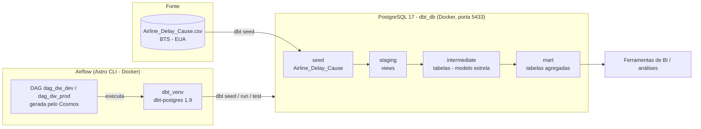
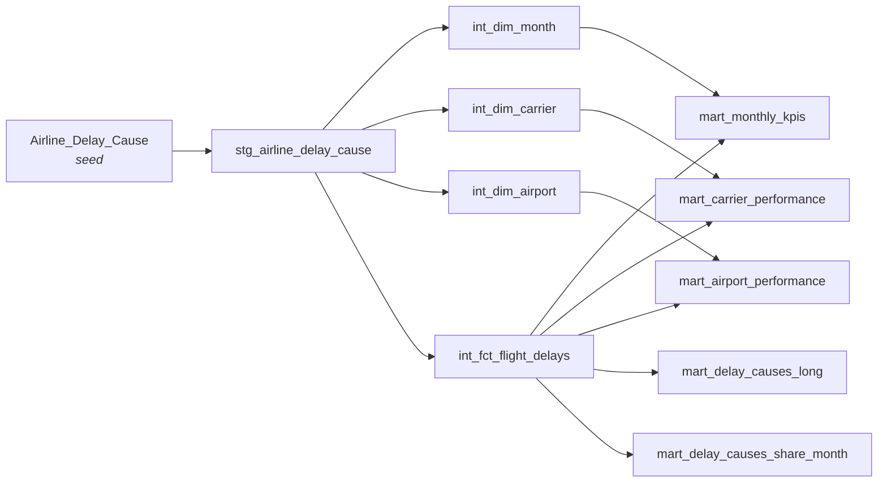
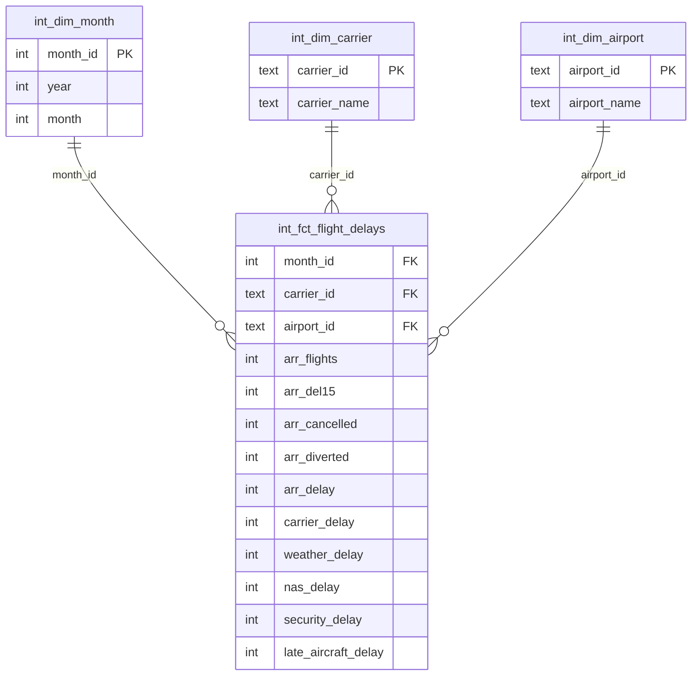

# Projeto Prático de Engenharia de Dados

Pipeline de dados ponta a ponta sobre **atrasos de voos nos EUA**: os dados brutos são carregados em um PostgreSQL, transformados em um Data Warehouse com **dbt** (camadas staging → intermediate → mart) e orquestrados diariamente pelo **Apache Airflow** (via Astro CLI + Astronomer Cosmos).

---

## Sumário

1. [Visão geral](#visão-geral)
2. [Arquitetura](#arquitetura)
3. [Stack utilizada](#stack-utilizada)
4. [Estrutura de pastas](#estrutura-de-pastas)
5. [Os dados](#os-dados)
6. [Etapa 1 — Ambiente local (`01.local_setup`)](#etapa-1--ambiente-local-01local_setup)
7. [Etapa 2 — Data Warehouse com dbt (`02.data_warehouse`)](#etapa-2--data-warehouse-com-dbt-02data_warehouse)
8. [Etapa 3 — Orquestração com Airflow (`03.airflow`)](#etapa-3--orquestração-com-airflow-03airflow)
9. [Como executar o projeto do zero](#como-executar-o-projeto-do-zero)
10. [Ambientes dev e prod](#ambientes-dev-e-prod)
11. [Portas utilizadas](#portas-utilizadas)
12. [Problemas comuns](#problemas-comuns)

---

## Visão geral

O projeto é dividido em três etapas, cada uma em sua própria pasta:

| Etapa | Pasta | O que faz |
|---|---|---|
| 1 | `01.local_setup` | Sobe o PostgreSQL (Docker) que funciona como Data Warehouse e prepara o ambiente Python com o dbt |
| 2 | `02.data_warehouse` | Projeto dbt: carrega o CSV (seed) e cria as tabelas/views de staging, intermediate e mart |
| 3 | `03.airflow` | Airflow rodando via Astro CLI; o Cosmos transforma o projeto dbt em uma DAG com uma task por modelo |

**Resultado final:** tabelas analíticas (marts) prontas para consumo por ferramentas de BI, com KPIs mensais, desempenho por companhia aérea, por aeroporto e por causa de atraso — atualizadas automaticamente todos os dias.

---

## Arquitetura



### Fluxo de execução

1. O Airflow lê `dags/dag.py`. O **Cosmos** (`DbtDag`) inspeciona o projeto dbt montado em `/usr/local/airflow/dbt/dw` e cria **uma task para cada seed e modelo**, respeitando as dependências declaradas com `ref()`.
2. Diariamente (`@daily`), o scheduler dispara a DAG.
3. Cada task:
   1. gera um `profiles.yml` temporário a partir da **conexão do Airflow** (`docker_postgres_db` ou `railway_postgres_db`);
   2. roda `dbt deps` (instala `dbt_utils`, `dbt_expectations`);
   3. executa o executável `dbt_venv/bin/dbt` com o comando daquele nó (`seed`, `run --select <modelo>`, `test`).
4. O dbt conecta no PostgreSQL e materializa as views/tabelas em cada camada.

### Linhagem dos modelos (DAG do dbt)



---

## Stack utilizada

| Ferramenta | Versão | Papel |
|---|---|---|
| PostgreSQL | 17 (Docker) | Data Warehouse |
| dbt-core / dbt-postgres | 1.10+ local / 1.9.0 no Airflow | Transformações SQL em camadas |
| dbt_utils | 1.3.0 | Macros utilitárias |
| dbt_expectations | 0.10.8 | Testes avançados de qualidade de dados |
| Apache Airflow | 3.x (Astro Runtime 3.1-8) | Orquestração |
| Astro CLI | — | Sobe o Airflow localmente em Docker |
| astronomer-cosmos | — | Converte o projeto dbt em DAG do Airflow |
| uv | — | Gerenciador de ambiente/dependências Python (etapa 1) |
| Docker / Docker Compose | — | Containers do Postgres e do Airflow |

---

## Estrutura de pastas

```
projeto_engenharia_de_dados/
├── 01.local_setup/
│   ├── docker-compose.yml        # PostgreSQL 17 do Data Warehouse (porta 5433)
│   ├── pyproject.toml / uv.lock  # Dependências Python (dbt, pandas, etc.)
│   └── .env                      # DBT_USER e DBT_PASSWORD (não versionar!)
│
├── 02.data_warehouse/
│   └── dw/                       # Projeto dbt
│       ├── dbt_project.yml       # Configuração do projeto e materializações
│       ├── packages.yml          # dbt_utils e dbt_expectations
│       ├── profiles.yml          # Conexão local (ignorado pelo git)
│       ├── seeds/
│       │   └── Airline_Delay_Cause.csv
│       └── models/
│           ├── staging/          # Limpeza e tipagem (views)
│           ├── intermediate/     # Dimensões e fato (tabelas)
│           └── mart/             # Agregações para BI (tabelas)
│
└── 03.airflow/                   # Projeto Astro (Airflow)
    ├── Dockerfile                # Imagem Astro Runtime + virtualenv com dbt
    ├── requirements.txt          # Pacotes Python do Airflow (cosmos, provider postgres)
    ├── docker-compose.override.yml  # Monta ./dbt/dw dentro dos containers
    ├── .astro/config.yaml        # Porta do Postgres interno do Airflow (5435)
    ├── dags/
    │   └── dag.py                # DAG gerada pelo Cosmos
    └── dbt/
        └── dw/                   # Cópia do projeto dbt usada pelo Airflow
```

> **Atenção:** `03.airflow/dbt/dw` é uma **cópia** de `02.data_warehouse/dw`. Ao alterar modelos em `02.data_warehouse`, lembre-se de replicar a mudança em `03.airflow/dbt/dw`, pois é essa cópia que o Airflow executa.

---

## Os dados

**Fonte:** *Airline On-Time Statistics and Delay Causes* — Bureau of Transportation Statistics (BTS), Departamento de Transportes dos EUA.

- Arquivo: `seeds/Airline_Delay_Cause.csv`
- Volume: ~318 mil linhas
- Período: **jun/2003 a mai/2022**
- Granularidade: **1 linha por mês × companhia aérea × aeroporto**

| Coluna | Descrição |
|---|---|
| `year`, `month` | Ano e mês de referência |
| `carrier`, `carrier_name` | Código e nome da companhia aérea (ex: `AA` – American Airlines) |
| `airport`, `airport_name` | Código IATA e nome do aeroporto (ex: `ATL`) |
| `arr_flights` | Total de voos que chegaram |
| `arr_del15` | Voos com 15+ minutos de atraso |
| `arr_cancelled`, `arr_diverted` | Voos cancelados / desviados |
| `arr_delay` | Minutos totais de atraso |
| `carrier_delay` | Minutos de atraso por culpa da companhia (manutenção, tripulação) |
| `weather_delay` | Minutos de atraso por clima |
| `nas_delay` | Minutos de atraso pelo sistema aéreo nacional (controle de tráfego) |
| `security_delay` | Minutos de atraso por segurança/triagem |
| `late_aircraft_delay` | Minutos de atraso por aeronave atrasada do voo anterior |
| `*_ct` | Contagem (fracionária) de ocorrências de cada causa |

---

## Etapa 1 — Ambiente local (`01.local_setup`)

Sobe o **PostgreSQL 17** que será o Data Warehouse.

**`docker-compose.yml`**

- Container: `dbt_postgres`
- Banco criado automaticamente: `dbt_db`
- Usuário e senha lidos do arquivo `.env` (`DBT_USER`, `DBT_PASSWORD`)
- Porta: `5433` na máquina → `5432` no container (evita conflito com um Postgres instalado localmente e com o Postgres interno do Airflow)
- Volume `postgres_data`: os dados sobrevivem a reinícios do container
- Healthcheck com `pg_isready` a cada 5 segundos

**`pyproject.toml`** (gerenciado com `uv`, Python ≥ 3.13)

Instala `dbt-core`, `dbt-postgres` e bibliotecas de apoio (`pandas`, `numpy`, `duckdb`, `faker`, `matplotlib`) para rodar o dbt manualmente e explorar os dados fora do Airflow.

---

## Etapa 2 — Data Warehouse com dbt (`02.data_warehouse`)

### Configuração (`dbt_project.yml`)

- Projeto e perfil: `dw`
- Variável `dbt_date:time_zone = America/Sao_Paulo`
- Materialização por camada:

| Camada | Materialização | Motivo |
|---|---|---|
| `staging` | `view` | Barata de recriar, sem custo de armazenamento |
| `intermediate` | `table` | Consultada com frequência pelos marts |
| `mart` | `table` | Consumo direto por BI, precisa ser rápida |

### Seed

`Airline_Delay_Cause.csv` é carregado no banco com `dbt seed`, virando a tabela `Airline_Delay_Cause` — é a **camada raw** do projeto.

### Camada staging

**`stg_airline_delay_cause`** (view)

- Seleciona as colunas do seed e aplica **tipagem explícita** (`integer`, `numeric`, `text`).
- Cria a chave de tempo **`year_month_key`** = `year * 100 + month` (ex: `202205`).
- Não altera a granularidade: continua 1 linha por mês × companhia × aeroporto.

### Camada intermediate — modelo dimensional (estrela)

| Modelo | Tipo | Chave | Descrição |
|---|---|---|---|
| `int_dim_month` | Dimensão | `month_id` | Meses distintos (`year`, `month`) |
| `int_dim_carrier` | Dimensão | `carrier_id` | Companhias aéreas; `max(carrier_name)` resolve nomes duplicados |
| `int_dim_airport` | Dimensão | `airport_id` | Aeroportos; `max(airport_name)` resolve nomes duplicados |
| `int_fct_flight_delays` | Fato | `month_id` + `carrier_id` + `airport_id` | Métricas de voos, atrasos em minutos e contagem por causa |



### Camada mart — tabelas para análise

| Modelo | Granularidade | Principais métricas |
|---|---|---|
| `mart_monthly_kpis` | 1 linha por mês | voos, atrasados 15+, `pct_delayed_15m`, cancelados, desviados, minutos de atraso |
| `mart_carrier_performance` | 1 linha por companhia | voos, atrasados 15+, `pct_delayed_15m`, cancelados, minutos de atraso |
| `mart_airport_performance` | 1 linha por aeroporto | voos, atrasados 15+, `pct_delayed_15m`, cancelados, minutos de atraso |
| `mart_delay_causes_long` | mês × companhia × aeroporto × causa | minutos de atraso por causa em **formato longo** (unpivot via `UNION ALL`) — ideal para gráficos filtráveis por causa |
| `mart_delay_causes_share_month` | 1 linha por mês | % de cada causa (`pct_carrier`, `pct_weather`, `pct_nas`, `pct_security`, `pct_late_aircraft`) sobre o atraso total do mês |

Todos os percentuais usam `CASE WHEN total = 0 THEN 0` para evitar divisão por zero.

### Pacotes (`packages.yml`)

- **dbt_utils** — macros como `generate_surrogate_key`, `unpivot`, `date_spine`.
- **dbt_expectations** — testes de qualidade (ranges, nulos, valores aceitos). Depende do `dbt_date`, que também é instalado pelo `dbt deps`.

---

## Etapa 3 — Orquestração com Airflow (`03.airflow`)

Projeto criado com o **Astro CLI** (`astro dev init`), que sobe o Airflow 3 em containers Docker.

### `Dockerfile`

```dockerfile
FROM astrocrpublic.azurecr.io/runtime:3.1-8
RUN python -m venv dbt_venv && . dbt_venv/bin/activate \
    && pip install --no-cache-dir dbt-postgres==1.9.0 && deactivate
```

O dbt é instalado em um **virtualenv separado** (`/usr/local/airflow/dbt_venv`) para que suas dependências não conflitem com as do Airflow. O Cosmos chama esse executável diretamente.

### `requirements.txt`

Pacotes instalados no Python **principal** do Airflow:

- `astronomer-cosmos` — integração dbt + Airflow.
- `apache-airflow-providers-postgres` — habilita o tipo de conexão **Postgres** na interface do Airflow (sem ele, a opção não aparece).

> O arquivo precisa se chamar exatamente `requirements.txt`; o Astro ignora qualquer outro nome.

### `docker-compose.override.yml`

Monta a pasta local `./dbt/dw` em `/usr/local/airflow/dbt/dw` nos containers **scheduler** e **dag-processor**, para que o Cosmos consiga ler o projeto dbt (e alterações nos modelos apareçam sem rebuild da imagem).

### `.astro/config.yaml`

Muda a porta do Postgres **interno** do Airflow (metadados) para `5435`, evitando conflito com o Postgres do Windows (`5432`) e com o Data Warehouse (`5433`).

### `dags/dag.py` — como o dbt é executado

Não há nenhum `dbt run` escrito explicitamente: quem executa o dbt é o **Cosmos**, através da classe `DbtDag`.

| Bloco | O que faz |
|---|---|
| `ProfileConfig` (dev/prod) | Gera o `profiles.yml` do dbt a partir de uma **conexão do Airflow** (`PostgresUserPasswordProfileMapping`) — as credenciais ficam no Airflow, não no código |
| `Variable.get("dbt_env")` | Lê a variável `dbt_env` do Airflow (`dev` por padrão) e escolhe o perfil |
| `ProjectConfig` | Caminho do projeto dbt dentro do container: `/usr/local/airflow/dbt/dw` |
| `ExecutionConfig` | Caminho do executável: `$AIRFLOW_HOME/dbt_venv/bin/dbt` |
| `operator_args` | `install_deps=True` (roda `dbt deps`) e `target` (dev/prod) |
| `schedule="@daily"` | Execução diária, `catchup=False`, 2 retries por task |
| `dag_id` | `dag_dw_dev` ou `dag_dw_prod`, conforme o ambiente |

Ao carregar o arquivo, o Cosmos lê o projeto dbt e gera automaticamente:

- uma task `seed` para o CSV;
- um grupo de tasks por modelo (`run` e, quando houver testes declarados, `test`);
- as dependências entre elas, seguindo os `ref()` do SQL.

Nos **logs** de cada task, na interface do Airflow, dá para ver o comando dbt completo que foi montado e a saída do dbt.

---

## Como executar o projeto do zero

### Pré-requisitos

- Docker Desktop
- [Astro CLI](https://www.astronomer.io/docs/astro/cli/install-cli)
- [uv](https://docs.astral.sh/uv/) (opcional, para rodar o dbt fora do Airflow)

### 1. Subir o Data Warehouse

Crie o arquivo `01.local_setup/.env`:

```env
DBT_USER=seu_usuario
DBT_PASSWORD=sua_senha
```

Depois:

```bash
cd 01.local_setup
docker compose up -d
```

### 2. (Opcional) Rodar o dbt manualmente

Crie `02.data_warehouse/dw/profiles.yml` (ele é ignorado pelo git):

```yaml
dw:
  target: dev
  outputs:
    dev:
      type: postgres
      host: localhost
      port: 5433
      user: seu_usuario
      password: sua_senha
      dbname: dbt_db
      schema: public
      threads: 4
```

E execute:

```bash
cd 01.local_setup
uv sync
cd ../02.data_warehouse/dw
uv run --project ../../01.local_setup dbt deps
uv run --project ../../01.local_setup dbt build --profiles-dir .
```

### 3. Subir o Airflow

```bash
cd 03.airflow
astro dev start
```

A interface fica em **http://localhost:8080**.

> Sempre que alterar `requirements.txt`, `packages.txt` ou `Dockerfile`, rode `astro dev restart` para reconstruir a imagem.

### 4. Criar a conexão no Airflow

Em **Admin → Connections → Add Connection**:

| Campo | Valor |
|---|---|
| Connection Id | `docker_postgres_db` |
| Connection Type | `Postgres` |
| Host | `host.docker.internal` |
| Database | `dbt_db` |
| Login | valor de `DBT_USER` |
| Password | valor de `DBT_PASSWORD` |
| Port | `5433` |

> O Host é `host.docker.internal` (e não `localhost`) porque o Airflow roda dentro de um container: `localhost` apontaria para o próprio container do Airflow.

### 5. Executar a DAG

Ative e dispare a DAG **`dag_dw_dev`** na interface. Ao final, as tabelas estarão em `dbt_db.public`:

```sql
select * from public.mart_monthly_kpis order by month_id;
```

---

## Ambientes dev e prod

A DAG suporta dois ambientes, escolhidos pela **Variable** `dbt_env` do Airflow (**Admin → Variables**):

| `dbt_env` | Conexão usada | Banco | DAG gerada |
|---|---|---|---|
| `dev` (padrão) | `docker_postgres_db` | PostgreSQL local (Docker) | `dag_dw_dev` |
| `prod` | `railway_postgres_db` | PostgreSQL remoto (Railway) | `dag_dw_prod` |

Para usar prod, crie a conexão `railway_postgres_db` com os dados do banco no Railway e defina `dbt_env = prod`. Qualquer outro valor gera erro na importação da DAG.

---

## Portas utilizadas

| Porta | Serviço |
|---|---|
| `5432` | Reservada (Postgres instalado localmente no Windows, se houver) |
| `5433` | PostgreSQL do Data Warehouse (`dbt_postgres`) |
| `5435` | PostgreSQL interno do Airflow (metadados) |
| `8080` | Interface web do Airflow |

---

## Problemas comuns

| Sintoma | Causa | Solução |
|---|---|---|
| Tipo de conexão **Postgres** não aparece no Airflow | `apache-airflow-providers-postgres` não instalado (ou `requirements.txt` com nome errado) | Adicionar ao `requirements.txt` e rodar `astro dev restart` |
| `connection refused` ao conectar no banco | Host `localhost` na conexão, ou container `dbt_postgres` parado | Usar `host.docker.internal:5433` e `docker compose up -d` em `01.local_setup` |
| DAG não aparece / erro de import | Projeto dbt não montado ou `dbt_env` inválido | Conferir `docker-compose.override.yml` e a variável `dbt_env` (`dev` ou `prod`) |
| Mudança em um modelo não reflete no Airflow | Alteração feita só em `02.data_warehouse` | Replicar em `03.airflow/dbt/dw` |
| Conflito de porta ao subir containers | Outro serviço usando 5432/5433/5435 | Ajustar as portas no `docker-compose.yml` ou em `.astro/config.yaml` |
